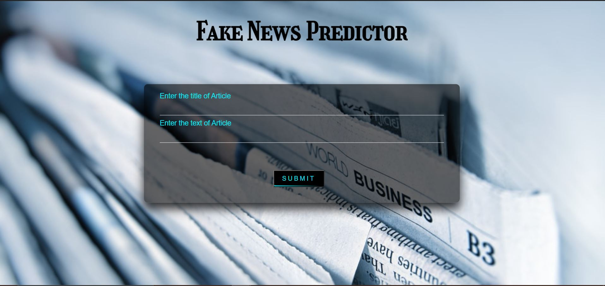
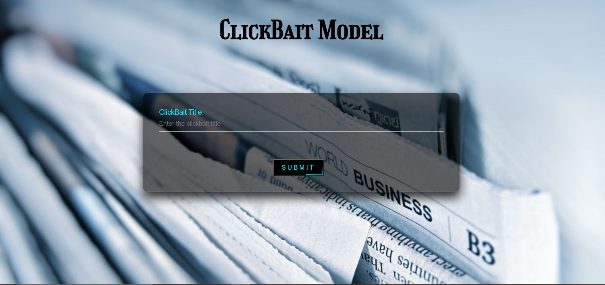
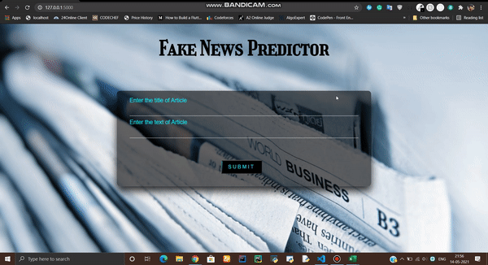

# 📰 Fake News & Clickbait Detection Project 💡

This project aims to detect **all kinds of fake news**, including those clickbait-y headlines we all know! 🎯

   

## 🚨 Problem Statement

With the increasing spread of **misinformation** 📰, it's important to distinguish between real news and fabricated stories. The two categories are:

- **Fake News**: Articles that are completely false, without any factual sources. ❌
- **Clickbait News**: Content designed to get clicks by exaggerating headlines. ⚠️

## 🔍 Models Used:

### 🤖 Fake News Model (LSTM):
Long Short-Term Memory (LSTM) is a variant of Recurrent Neural Networks (RNN) that excels with long-sequence data! 🧠 It's great for addressing the vanishing gradient problem in traditional RNNs.


Our simple LSTM model achieved **92.7% accuracy** on fake news detection!

### 📰 Clickbait Model:
For clickbait detection, we went with **Multinomial Naive Bayes (NB)** since it delivered the highest accuracy.

---

## 🎯 Final Model Accuracies:

- **Fake News (LSTM)**: 92.7% 💪
- **Clickbait (Multinomial NB)**: 92.1% 👏
- **Passive Aggressive Model**: 96.1% 🔥

## 🗂️ Datasets:

- **Clickbait Dataset**:
  - **Tagline**: The headline text
  - **ClickBait**: 0 or 1, indicating if it's clickbait 🧲

- **Fake News Dataset**:
  - **Title**: The article headline
  - **Text**: Content of the article
  - **Label**: Fake or not 🧐

---

## 🚀 How to Run?

Just follow these simple steps:

```bash
$ pip install -r requirements.txt
$ python app.py
```

And you're good to go! 🎉

---

## 🌐 Website

We also created a cool **web interface** 🌍 using Flask for the backend and HTML/CSS for the frontend. 

### Fake News Detector:


### Clickbait Detector:


### Short Demo (It might take a few seconds to load ⌛):


---

## 📚 References:

- [Fake-News-Dataset](https://www.kaggle.com/c/fake-news/data?select=train.csv)
- [Clickbait-Dataset](https://www.kaggle.com/amananandrai/clickbait-dataset)

### Research Papers:

- **Fake News**: 
  - [Paper 1](https://www.ijitee.org/wp-content/uploads/papers/v8i11/K18290981119.pdf)
  - [Paper 2](https://link.springer.com/chapter/10.1007%2F978-981-15-8354-4_26)
- **Clickbait**:
  - [Paper 1](https://link.springer.com/chapter/10.1007/978-3-319-30671-1_72)
  - [Paper 2](https://cutt.ly/2bdhA9p)

---

## 🌱 Future Scope

- **Social Media Integration**: Imagine this as a browser plugin to stop misinformation before it spreads! 🌐
- **Focus on Political News**: Prevent misleading content from swaying elections. 🗳️

---

Happy coding! 💻  
Made with 💚 from India 🇮🇳
